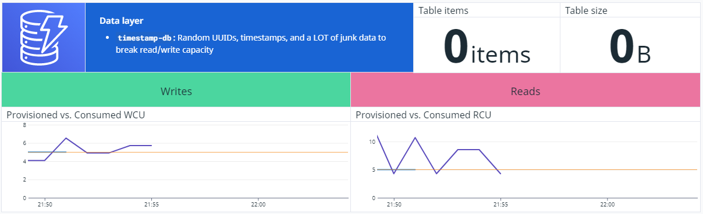
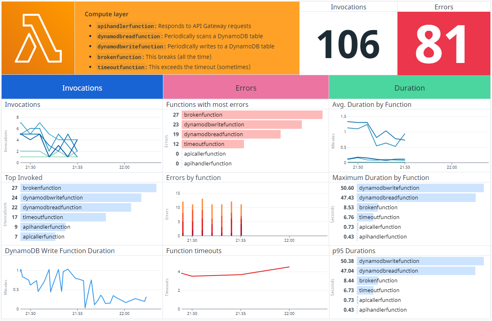
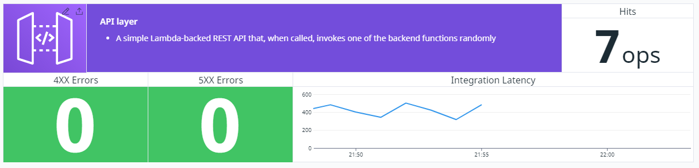
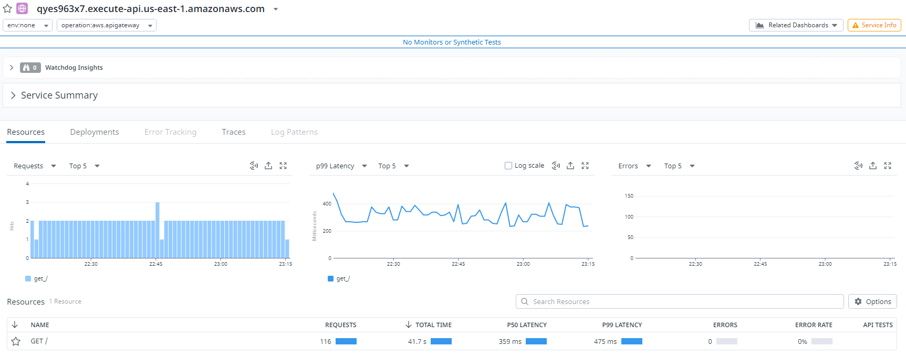
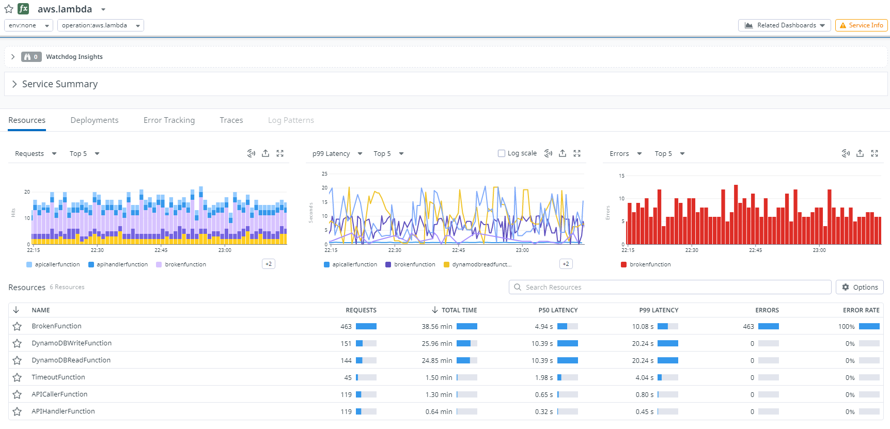
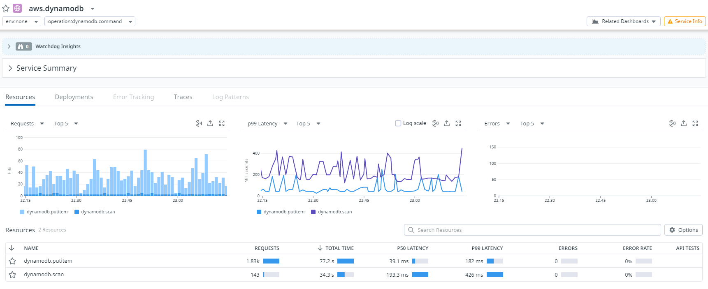

# Datadog Take Home Submission

## Objectives

* A fully running and documented project that is integrated with Datadog.
* You can use any technologies that you like, you may use existing OSS projects to power your project.
* The project doesn't need to do anything "real," but it should show well within Datadog.
* The goal is to showcase Datadog, not have a project that does any real work.
* The Datadog platform has many products and features. We do not expect you to cover each one in your project.
  * Feel free to explore any areas of the Datadog platform that interest you and/or even send fake or simulated data through our agent or API (we do this ourselves for certain demo data).

## Overview

This project implements several different products of Datadog. To generate data used in the products, several AWS workloads are deployed using the AWS Cloud Development Kit (CDK).

* Information on the deployment steps can be found at [DEPLOYMENT.md](./DEPLOYMENT.md).
* Information on the demo architecture can be found at [ARCHITECTURE.md](./ARCHITECTURE.md).

## Datadog Products

The following sections outline the Datadog products used and their outcomes.

### Infrastructure and Dashboards

The [Infrastructure](https://docs.datadoghq.com/infrastructure/) and [Dashboards](https://docs.datadoghq.com/dashboards/) components were used to create a simluated dashboard for the different layers of the demo architecture (Database, Compute, and REST API). Since this is a serverless stack, some of the primary metrics of concern were:

#### Database layer

* Live item count
* Table size
* Provisioned write capacity versus consumed write capacity
* Provisioned read capacity versus consumed read capacity

#### Compute layer

* Function invocations
* Top invoked functions
* Duration for critical/high-importance functions (in this case, the one responsible for writing to DynamoDB)
* Top functions with errors
* Errors by function
* Function timeouts
* Average function duration
* Max duration by function
* p95 durations

#### REST API layer

* Hits (requests)
* 4XX errors
* 5XX errors
* Integration (backend) latency

### APM

The following screenshots describe some APM activity generated by the demo stack.

API Gateway `GET` request performance:

Lambda function performance:

DynamoDB table performance:

